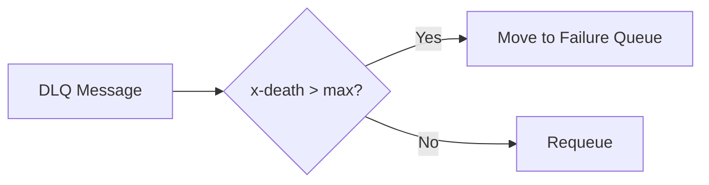

# RabbitMQ Retry Checker

Detect and handle infinite retry loops in RabbitMQ Dead Letter Queues.

## How It Works



The tool checks `x-death` count on messages and moves those exceeding the retry limit to a permanent failure queue.

## Quick Start

```bash
# Install dependencies
pip install -r requirements.txt

# Run with config file
python rmq_retry_checker.py config.yaml
```

## Configuration

Create `config.yaml`:

```yaml
rabbitmq:
  host: localhost
  port: 5672
  username: guest
  password: guest
  # mgmt_port: 15672     # Required for wildcard support
  # vhost: /              # Optional, defaults to /
  # use_ssl: false        # Optional, enable for TLS
  # ssl_verify: true      # Optional, set false for self-signed certs

queues:
  dlq_name: my_dlq                        # Supports wildcards: dlq.*
  target_queue: permanent_failure_queue   # Supports wildcards: dead.*
  max_retry_count: 3
```

See [Configuration Guide](docs/configuration.md) for all options.

## Wildcard Support

Process multiple queues at once using wildcards in config.yaml:

```yaml
queues:
  dlq_name: "dlq.*"
  target_queue: "dead.*"
```

This matches `dlq.orders`, `dlq.users`, etc. and creates corresponding `dead.orders`, `dead.users` targets.

**Note:** Wildcards require the RabbitMQ Management API (default port 15672).

## Documentation

- [Architecture & Flowcharts](docs/architecture.md)
- [Configuration Reference](docs/configuration.md)
- [Scheduling (Cron/Systemd)](docs/scheduling.md)
