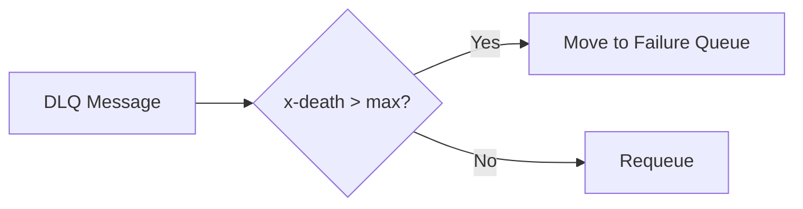
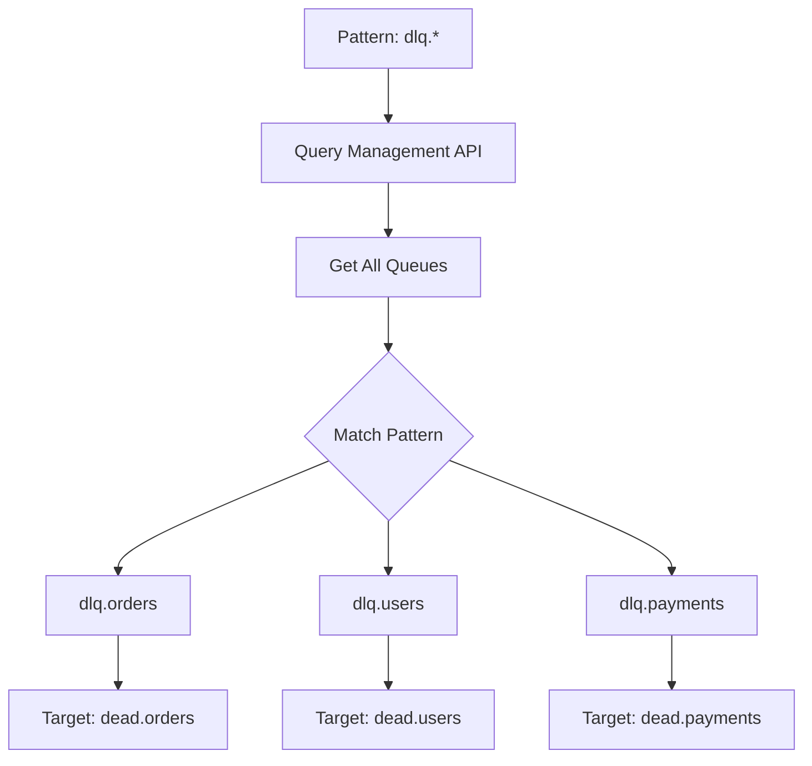
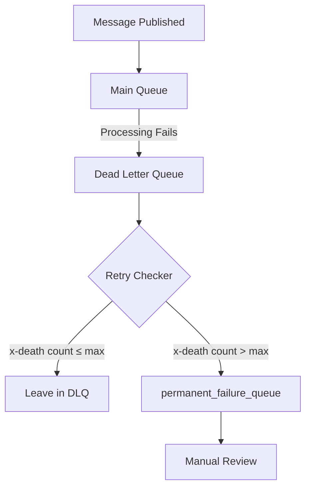
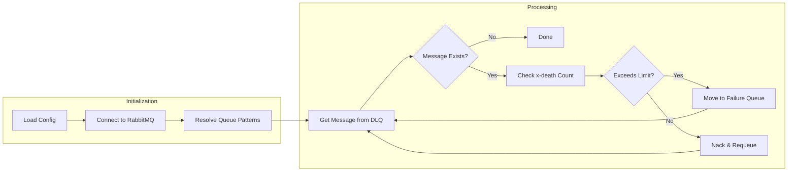
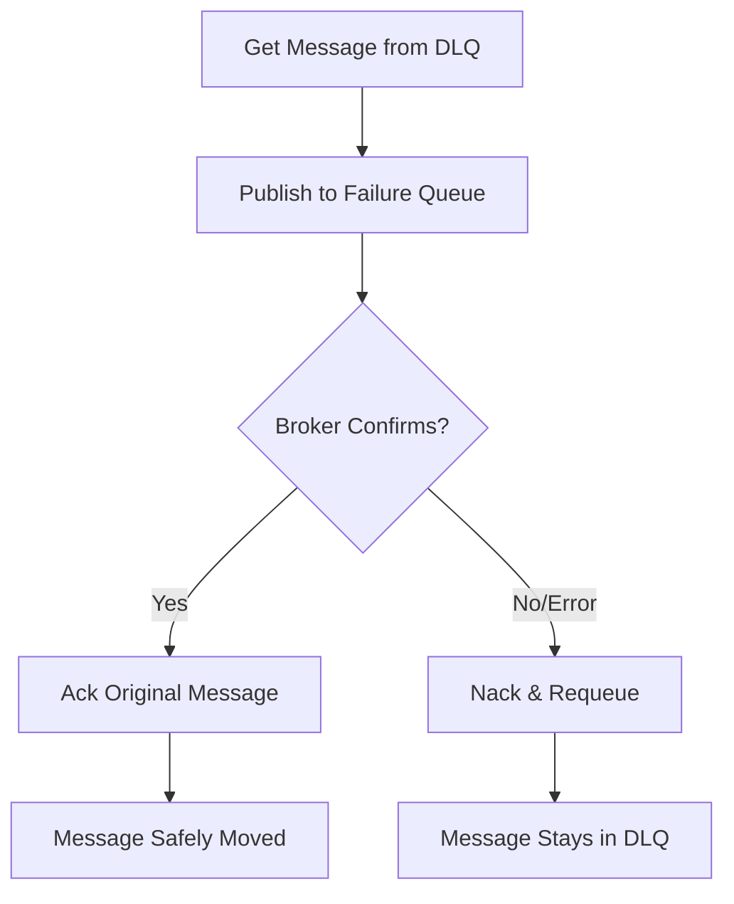

# RabbitMQ Retry Checker

Detect and handle infinite retry loops in RabbitMQ Dead Letter Queues.

**Navigation:** [How It Works](#how-it-works) · [Quick Start](#quick-start) · [Configuration](#configuration) · [Wildcard Support](#wildcard-support) · [Architecture](#architecture) · [Scheduling](#scheduling)

---

## How It Works



The tool checks `x-death` count on messages and moves those exceeding the retry limit to a permanent failure queue. Messages within the limit are left in the DLQ for retry.

---

## Quick Start

```bash
pip install -r requirements.txt
python rmq_retry_checker.py config.yaml
```

---

## Configuration

Create `config.yaml`:

```yaml
rabbitmq:
  host: localhost
  port: 5672
  username: guest
  password: guest
  mgmt_port: 15672      # Required for wildcard support
  vhost: /              # Optional, defaults to /
  use_ssl: false        # Optional, enable for TLS
  ssl_verify: true      # Optional, set false for self-signed certs

queues:
  dlq_name: my_dlq                        # Supports wildcards: dlq.*
  target_queue: permanent_failure_queue   # Supports wildcards: dead.*
  max_retry_count: 3
```

---

## Wildcard Support

Process multiple queues at once using wildcards:

```yaml
queues:
  dlq_name: "dlq.*"
  target_queue: "dead.*"
```

This matches `dlq.orders`, `dlq.users`, etc. and creates corresponding `dead.orders`, `dead.users` targets.



> **Note:** Wildcards require the RabbitMQ Management API (default port 15672).

---

## Architecture

### Message Flow



> **Note:** Messages within the retry limit are left in the DLQ (via nack with requeue). The retry mechanism depends on your RabbitMQ setup—typically the DLQ is configured to dead-letter back to the main queue after a TTL.

### Processing Logic



### Message Safety

The tool uses RabbitMQ's publisher confirms to ensure no messages are lost:



| Scenario | Outcome |
|----------|---------|
| Script dies before publish | Message remains in DLQ (no loss) |
| Script dies after publish, before ack | Message may be duplicated on restart |
| Broker rejects publish | Message remains in DLQ, error logged |
| Network failure during publish | Message remains in DLQ (no loss) |

---

## Scheduling

### Cron

Run every 5 minutes:

```bash
*/5 * * * * /usr/bin/python3 /opt/rmq_retry_checker.py /etc/rmq/config.yaml
```

### Systemd Timer

**Service file** (`/etc/systemd/system/rmq-checker.service`):

```ini
[Unit]
Description=RabbitMQ DLQ Retry Checker

[Service]
Type=oneshot
ExecStart=/usr/bin/python3 /opt/rmq_retry_checker.py /etc/rmq/config.yaml
```

**Timer file** (`/etc/systemd/system/rmq-checker.timer`):

```ini
[Unit]
Description=Run RMQ Retry Checker every 5 minutes

[Timer]
OnBootSec=5min
OnUnitActiveSec=5min

[Install]
WantedBy=timers.target
```

**Enable the timer:**

```bash
sudo systemctl daemon-reload
sudo systemctl enable --now rmq-checker.timer
```

**Check status:**

```bash
systemctl status rmq-checker.timer
systemctl list-timers --all
```
