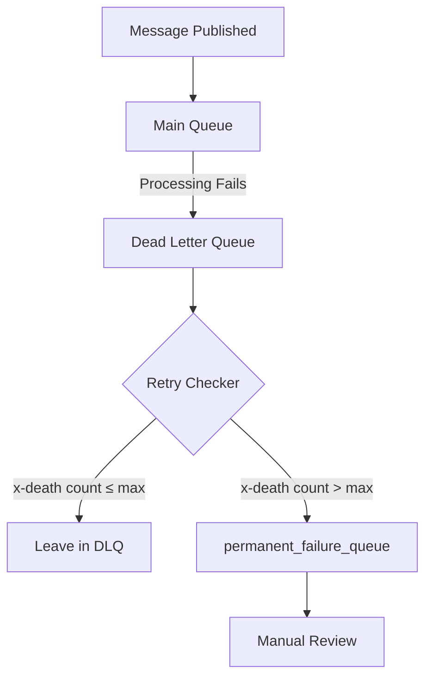
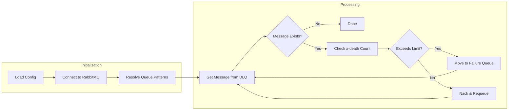
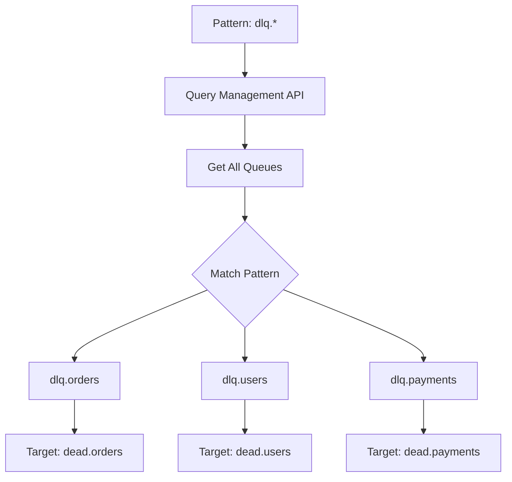
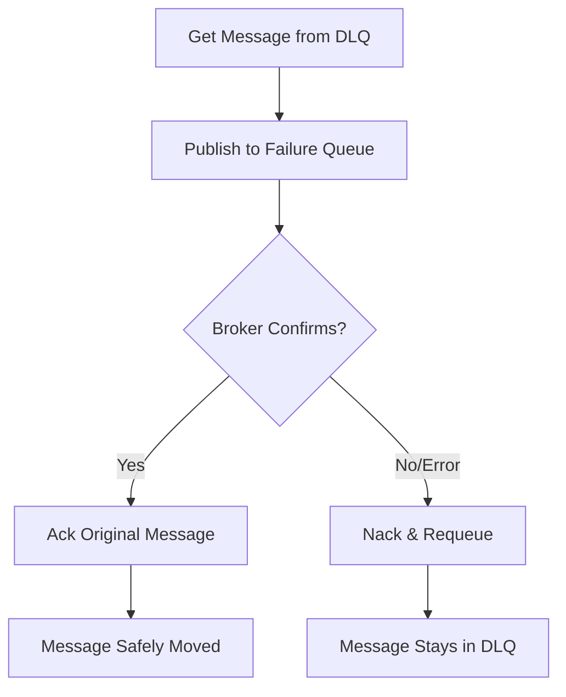

# Architecture

This document explains how the RabbitMQ Retry Checker works.

## Overview

The tool monitors Dead Letter Queues (DLQs) for messages that have exceeded a retry threshold and moves them to a permanent failure queue.

## Message Flow

> **Note:** Messages within the retry limit are left in the DLQ (via nack with requeue). The retry mechanism depends on your RabbitMQ setup—typically the DLQ is configured to dead-letter back to the main queue after a TTL, allowing the consumer to retry processing.

## Processing Logic

## Wildcard Resolution

When using wildcard patterns like `dlq.*`:

## Components

| Component | Description |
|-----------|-------------|
| `Config` | Handles configuration from files, environment variables, and CLI |
| `RMQRetryChecker` | Main class that connects to RabbitMQ and processes messages |
| Management API | Used only when wildcard patterns are specified |

## Message Persistence

The tool uses RabbitMQ's publisher confirms to ensure no messages are lost during processing:

1. **Publisher Confirms**: The channel is set to confirm delivery mode. Each `basic_publish` blocks until the broker acknowledges receipt.
2. **Persistent Messages**: Messages moved to the failure queue are published with `delivery_mode=2` (persistent), ensuring they survive broker restarts.
3. **Mandatory Flag**: The `mandatory=True` flag ensures messages are routed to a queue; if not, an error is raised.
4. **Ack After Confirm**: The original message is only acknowledged from the DLQ after the broker confirms the publish succeeded.

**Failure Scenarios:**

| Scenario | Outcome |
|----------|---------|
| Script dies before publish | Message remains in DLQ (no loss) |
| Script dies after publish, before ack | Message may be duplicated (acceptable) |
| Broker rejects publish | Message remains in DLQ, error logged |
| Network failure during publish | Message remains in DLQ (no loss) |
