# Architecture

This document explains how the RabbitMQ Retry Checker works.

## Overview

The tool monitors Dead Letter Queues (DLQs) for messages that have exceeded a retry threshold and moves them to a permanent failure queue.

## Message Flow

```mermaid
flowchart TD
    A[Message Published] --> B[Main Queue]
    B -->|Processing Fails| C[Dead Letter Queue]
    C --> D{Retry Checker}
    D -->|x-death count ≤ max| E[Requeue to DLQ]
    D -->|x-death count > max| F[Permanent Failure Queue]
    E -->|Retry| C
    F --> G[Manual Review]
```

## Processing Logic

## Wildcard Resolution

When using wildcard patterns like `dlq.*`:

## Components

| Component | Description |
|-----------|-------------|
| `Config` | Handles configuration from files, environment variables, and CLI |
| `RMQRetryChecker` | Main class that connects to RabbitMQ and processes messages |
| Management API | Used only when wildcard patterns are specified |
